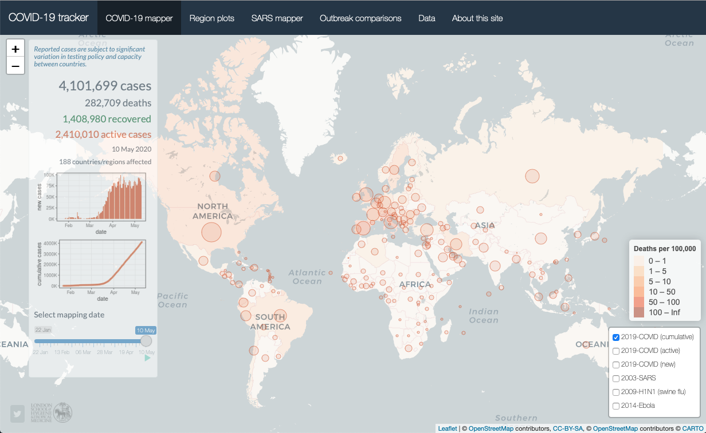

## COVID-19 interactive mapping tool

This github page contains the code and input data for the [interactive COVID-19 mapping tool available](https://vac-lshtm.shinyapps.io/ncov_tracker/) developed by the Vaccine Centre at the London School of Hygiene and Tropical Medicine.

The Shiny app, first launched on [11th February 2020](https://theconversation.com/coronavirus-outbreak-a-new-mapping-tool-that-lets-you-scroll-through-timeline-131422), aims to complement existing COVID-19 mapping dashboards (such as those developed by the [WHO](https://covid19.who.int) and [Johns Hopkins University](https://gisanddata.maps.arcgis.com/apps/opsdashboard/index.html#/bda7594740fd40299423467b48e9ecf6)) with several interactive features, including the timeline function, the ability to overlay past outbreaks, and an emphasis on normalised counts (per 100,000 individuals). 

## Analysis code

Key elements of the analysis code are as follows:
- *jhu_data_full.R* – an R script that extracts and reformats time-series from the [Johns Hopkins Center for Systems Science and Engineering github page](https://github.com/CSSEGISandData/COVID-19/tree/master/csse_covid_19_data/csse_covid_19_time_series). This script is run once daily to update the files contained in the *input_data* folder.
- *app.R* - an R script used to render the Shiny app. This consists of several plotting functions alongside the ui (user interface) and server code required to render the Shiny app. The script has become more complex over time as an increasing number of interactive features has been added.
- *input_data* - a folder containing dynamic input data relating to the evolving COVID-19 pandemic (updated by *jhu_data_full.R*) and static input data relating to past pandemics and country mapping coordinates.

## Other resources

Several resources proved invaluable when building this app, including:
- A [tutorial by Florianne Verkroost](https://rviews.rstudio.com/2019/10/09/building-interactive-world-maps-in-shiny/) on building interactive maps.
- The [SuperZIP app](https://shiny.rstudio.com/gallery/superzip-example.html) and [associated code](https://github.com/rstudio/shiny-examples/tree/master/063-superzip-example).
- The [RStudio Leaflet tutorials](https://rstudio.github.io/leaflet/)

## Authors
Dr Edward Parker, The Vaccine Centre, London School of Hygiene & Tropical Medicine
Quentin Leclerc, Department of Infectious Disease Epidemiology, London School of Hygiene & Tropical Medicine

## Contact
edward.parker@lshtm.ac.uk
